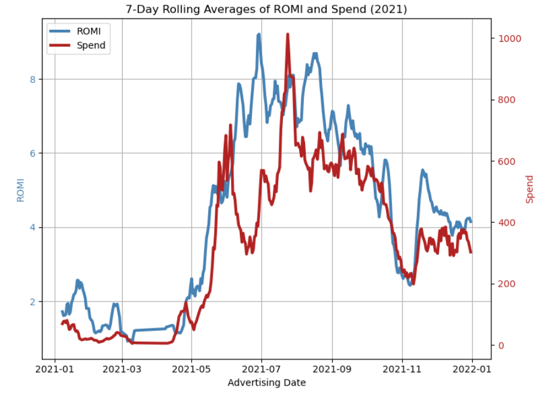

# 📊 Analytics Report on Facebook Advertising Campaigns

This Jupyter Notebook presents a comprehensive analysis of **Facebook advertising campaign performance** over a two-year period. The key focus is on evaluating **ROMI (Return on Marketing Investment)**, revenue and effectiveness of various campaign types across time.

---

## 🧰 Tools Used

- Python (Jupyter Notebook)
- Libraries:
  - `pandas`
  - `matplotlib`
  - `seaborn`
  - `numpy`
  - `scipy`

---

## 📌 How to Run

1. Clone this repository.
2. Open the notebook in Jupyter or Google Colab.
3. Run all cells to reproduce the full analysis.

---

## 🙌 Contributions

Analysis by: **Nataliia Yarema**  
